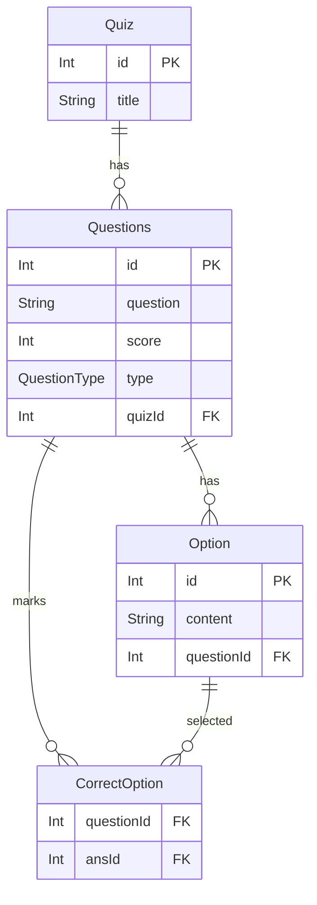

## Quiz App Backend (Node.js, Express, Prisma, PostgreSQL, Zod, Gemini)

### Features
- **Create Quiz**: Add a new quiz with a title.
- **List Quizzes**: Fetch all quizzes.
- **Add Questions to a Quiz**: Create MCQ, MSQ, and SUB questions for a quiz.
- **List Questions of a Quiz**: Fetch questions (with options) for a quiz.
- **Submit Answers and Score**: Submit answers for a quiz and get the total score.
- **AI-assisted Subjective Grading (Gemini)**: Uses Gemini to compare subjective (SUB) answers semantically against the correct answer and awards score on meaningful-match.
- **Consistent API Responses**: Unified response format via middleware (`message`, optional `data`).
- **Validation with Zod**: Strong request validation with helpful error messages.

### DB Architecture (ERD)
Prisma models define the schema. Relationships:
- `Quiz` 1—N `Questions`
- `Questions` 1—N `Option`
- `CorrectOption` is a join between `Questions` and `Option` marking correct answers
- `Questions.type` is an enum: `MCQ | MSQ | SUB`



Question type enum (Prisma): `MCQ`, `MSQ`, `SUB`.

### API Conventions
- Base URL: `http://localhost:3000`
- All JSON responses follow:
```json
{
  "message": "string",
  "data": any
}
```
- Errors use HTTP status codes and `message`; validation errors include an array of `{ field, message }`.

### Health Check
GET `/health`
- **Response** 200
```json
{ "message": "Everyhting is working fine!" }
```

## Quiz APIs

### Create Quiz
POST `/api/quiz`

Request body (validated):
```json
{ "title": "My First Quiz" }
```

Validation rules:
- `title`: string, required, non-empty

Responses:
- 201 Created
```json
{
  "message": "Quiz created successfully",
  "data": {
    "id": 1,
    "title": "My First Quiz"
  }
}
```
- 400 Bad Request (Zod)
```json
{
  "message": "Validation failed",
  "data": [
    { "field": "title", "message": "title(string) must be provided" }
  ]
}
```

### List Quizzes
GET `/api/quiz`

Responses:
- 200 OK
```json
{
  "message": "Quiz Found!",
  "data": [
    { "id": 1, "title": "My First Quiz" },
    { "id": 2, "title": "Another Quiz" }
  ]
}
```

### Submit Answers and Get Score
GET `/api/quiz/answer/:id`

Note: Endpoint expects a JSON body (array) despite being a GET. Consider switching to POST in the future for strict RESTfulness.

AI scoring behavior for `SUB` questions:
- The service compares the submitted answer with the stored correct answer using Gemini (see `service/GeminiService.js`).
- It focuses on semantic similarity (meaning/intent), not exact wording.
- If Gemini deems a match (threshold-based), full score for that question is awarded; otherwise 0.

Request body (validated):
```json
[
  { "questionId": 10, "answer": [21] },
  { "questionId": 11, "answer": [32,33] },
  { "questionId": 12, "answer": "Subjective text" }
]
```
- For `MCQ`: `answer` is array with a single option id
- For `MSQ`: `answer` is array with multiple option ids
- For `SUB`: `answer` is string

Responses:
- 200 OK
```json
{
  "message": "Score Array:  [/* per-question scores */]",
  "data": 7
}
```
- 400 Bad Request (Zod)
```json
{
  "message": "Validation failed",
  "data": [
    { "field": "0.answer", "message": "Expected array, received string" }
  ]
}
```
- 404 Not Found
```json
{ "message": "Quiz not found" }
```

## Question APIs

### Create Questions for a Quiz
POST `/api/question/:id`

Path params:
- `id`: quiz id (integer)

Request body (validated) — array of discriminated union by `type`:
```json
[
  {
    "type": "MCQ",
    "question": "Capital of France?",
    "option": ["Paris", "Lyon", "Marseille"],
    "correctoption": [0],
    "score": 5
  },
  {
    "type": "MSQ",
    "question": "Prime numbers",
    "option": ["2", "3", "4", "5"],
    "correctoption": [0,1,3],
    "score": 3
  },
  {
    "type": "SUB",
    "question": "Explain gravity",
    "correctoption": "A force attracting two bodies",
    "score": 10
  }
]
```

Validation rules by type:
- `MCQ`: `option`: string[], min 1; `correctoption`: number[], min 1; `score`: number
- `MSQ`: same as MCQ but multiple correct allowed
- `SUB`: `correctoption`: string, non-empty; `score`: number

Responses:
- 201 Created
```json
{ "message": "Questions created!" }
```
- 400 Bad Request (Zod)
```json
{
  "message": "Validation failed",
  "data": [ { "field": "0.option", "message": "Option must have at least 1 element" } ]
}
```
- 404 Not Found
```json
{ "message": "Quiz not found" }
```

### List Questions of a Quiz
GET `/api/question/:id`

Responses:
- 200 OK
```json
{
  "message": "Questions fetched successfully",
  "data": [
    {
      "id": 10,
      "question": "Capital of France?",
      "score": 5,
      "type": "MCQ",
      "quizId": 1,
      "Option": [
        { "id": 21, "content": "Paris" },
        { "id": 22, "content": "Lyon" }
      ]
    }
  ]
}
```
- 404 Not Found
```json
{ "message": "Quiz not found" }
```

### Validation Details (Zod)
- Quiz creation uses `quiz_schema`:
  - `title`: string, required, non-empty
- Question creation uses discriminated union on `type`: `MCQ | MSQ | SUB`
- Answer submission expects array of `{ questionId: number, answer: number[] | string }`

### Local Development
Run server:
```bash
npm run dev
```

Environment:
- `DATABASE_URL` (PostgreSQL) must be set for Prisma

Prisma:
```bash
npx prisma migrate dev
npx prisma generate
```


