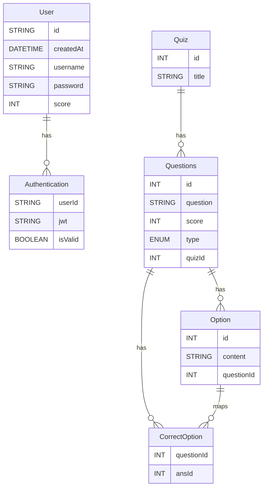

## Quiz App Backend (Node.js, Express, Prisma, PostgreSQL, Zod, Gemini)

This backend powers a quiz platform with quiz and question management, answer submission, and automated scoring. It supports MCQ, MSQ, and Subjective questions, validates requests with Zod, uses Prisma with PostgreSQL for persistence, and leverages Gemini to semantically evaluate subjective answers.

### Features
- **Create Quiz**: Add a new quiz with a title.
- **List Quizzes**: Fetch all quizzes.
- **Add Questions to a Quiz**: Create MCQ, MSQ, and SUB questions for a quiz.
- **List Questions of a Quiz**: Fetch questions (with options) for a quiz.
- **Submit Answers and Score**: Submit answers for a quiz and get the total score.
- **AI-assisted Subjective Grading (Gemini)**: Uses Gemini to compare subjective (SUB) answers semantically against the correct answer and awards score on meaningful-match.
- **Consistent API Responses**: Unified response format via middleware (`message`, optional `data`).
- **Validation with Zod**: Strong request validation with helpful error messages.
- **User Authentication**: Users authenticate with a unique username/password. A JWT is generated on login, stored in an HTTP-only cookie, and all quiz creation/question posting/answer submission routes are protected and require a valid JWT.
 - **Testing**: Unit test added to verify scoring logic (MCQ/MSQ/SUB aggregation).

### Setup Guide (Local)
1. Clone and install
```bash
git clone <repo-url>
cd "Quiz App Backend"
npm install
```
2. Configure environment(.env)
```bash
JWT_SECRET 
GEMINI_API_KEY
DATABASE_URL
PORT
```
3. Prisma setup
```bash
npx prisma generate
```
4. Run the server
```bash
npm run dev
# Server at http://localhost:3000
```

Run tests:
```bash
npm test
```


### DB Architecture (ERD)
Prisma models (PostgreSQL):
- `User` 1—N `Authentication`
- `Quiz` 1—N `Questions`
- `Questions` 1—N `Option`
- `CorrectOption` links `Questions` and correct `Option` rows via composite PK `[questionId, ansId]`
- `Questions.type` enum: `MCQ | MSQ | SUB`



Enum `Questions.type`: `MCQ`, `MSQ`, `SUB`.

### Design Choices & Project Flow
- Subjective grading uses Gemini for semantic similarity. A binary decision (match/no match) awards full score or zero.
- Request validation is enforced at routers using Zod; errors are returned in a consistent shape.
- Responses follow a standard `{ message, data? }` envelope for consistency across endpoints.
- Request flow and file overview:
  - `router/` (e.g., `Quiz.js`, `Question.js`): HTTP routes, parse JSON
  - `service/` (e.g., `QuizService.js`, `QuestionService.js`): Business logic and DB access via Prisma. `GeminiService.js` integrates AI grading for subjective answers.
  - `prisma/` (`schema.prisma`): Data model (Quiz, Questions, Option, CorrectOption), migrations, and client generation.
  - `utils/` (`Response.js`, `ResponseHandler.js`, `Schema.Zod.js`): Response envelope, Express response helpers, and Zod schemas.

### Endpoints Overview

#### API Summary (9 endpoints)
- User
  - POST `/api/user/login`
    ```json
    { "username": "string", "password": "string" }
    ```
    - Sets JWT as HTTP-only cookie on success
  - POST `/api/user/logout`
    - Clears JWT cookie
  - GET `/api/user/score`
    - Returns overall score of the authenticated user
  - GET `/api/user/rank`
    - Returns rank of the authenticated user

- Quiz
  - POST `/api/quiz`
    ```json
    { "title": "string" }
    ```
    - Creates a quiz
  - GET `/api/quiz`
    - Returns all quizzes
  - POST `/api/quiz/answer/:id`
    ```json
    [ { "questionId": 123, "answer": [] | "string" } ]
    ```
    - Returns per-question scores array and total score

- Question
  - POST `/api/question/:id`
    ```json
    [
      { "type": "MCQ", "question": "string", "option": ["string"], "correctoption": [0], "score": 0 },
      { "type": "MSQ", "question": "string", "option": ["string"], "correctoption": [0,1], "score": 0 },
      { "type": "SUB", "question": "string", "correctoption": "string", "score": 0 }
    ]
    ```
    - Creates questions for a quiz
  - GET `/api/question/:id`
    - Returns questions (with options) for a quiz

#### API Details
#### Health Check
GET `/health`
- **Response** 200
```json
{ "message": "Everyhting is working fine!" }
```

#### Quiz Router - /api/quiz/ 

##### Create Quiz
POST `/api/quiz`

Request body (validated):
```json
{ "title": "My First Quiz" }
```

Validation rules:
- `title`: string, required, non-empty

Responses:
- 201 Created
```json
{
  "message": "Quiz created successfully",
  "data": {
    "id": 1,
    "title": "My First Quiz"
  }
}
```
- 400 Bad Request (Zod)
```json
{
  "message": "Validation failed",
  "data": [
    { "field": "title", "message": "title(string) must be provided" }
  ]
}
```

##### List Quizzes
GET `/api/quiz`

Responses:
- 200 OK
```json
{
  "message": "Quiz Found!",
  "data": [
    { "id": 1, "title": "My First Quiz" },
    { "id": 2, "title": "Another Quiz" }
  ]
}
```

##### Submit Answers and Get Score
POST `/api/quiz/answer/:id`

AI scoring behavior for `SUB` questions:
- The service compares the submitted answer with the stored correct answer using Gemini (see `service/GeminiService.js`).
- If Gemini deems a match, full score for that question is awarded; otherwise 0.

Request body (validated):
```json
[
  { "questionId": 10, "answer": [21] },
  { "questionId": 11, "answer": [32,33] },
  { "questionId": 12, "answer": "Subjective text" }
]
```
- For `MCQ/MSQ`: `answer` is array containing option ids
- For `SUB`: `answer` is string

Responses:
- 200 OK
```json
{
  "message": "Score Array:  [/* per-question scores */]",
  "data": 7
}
```
- 400 Bad Request (Zod)
```json
{
  "message": "Validation failed",
  "data": [
    { "field": "0.answer", "message": "Expected array, received string" }
  ]
}
```
- 404 Not Found
```json
{ "message": "Quiz not found" }
```

#### Question router /api/question

##### Create Questions for a Quiz
POST `/api/question/:id`

Path params:
- `id`: quiz id (integer)

Request body (validated) — array of discriminated union by `type`:
```json
[
  {
    "type": "MCQ",
    "question": "Capital of France?",
    "option": ["Paris", "Lyon", "Marseille"],
    "correctoption": [0],
    "score": 5
  },
  {
    "type": "MSQ",
    "question": "Prime numbers",
    "option": ["2", "3", "4", "5"],
    "correctoption": [0,1,3],
    "score": 3
  },
  {
    "type": "SUB",
    "question": "Explain gravity",
    "correctoption": "A force attracting two bodies",
    "score": 10
  }
]
```

Validation rules by type:
- `MCQ`: `option`: string[], min 1; `correctoption`: number[], min 1; `score`: number
- `MSQ`: same as MCQ but multiple correct allowed
- `SUB`: `correctoption`: string, non-empty; `score`: number

Responses:
- 201 Created
```json
{ "message": "Questions created!" }
```
- 400 Bad Request (Zod)
```json
{
  "message": "Validation failed",
  "data": [ { "field": "0.option", "message": "Option must have at least 1 element" } ]
}
```
- 404 Not Found
```json
{ "message": "Quiz not found" }
```

##### List Questions of a Quiz
GET `/api/question/:id`

Responses:
- 200 OK
```json
{
  "message": "Questions fetched successfully",
  "data": [
    {
      "id": 10,
      "question": "Capital of France?",
      "score": 5,
      "type": "MCQ",
      "quizId": 1,
      "Option": [
        { "id": 21, "content": "Paris" },
        { "id": 22, "content": "Lyon" }
      ]
    }
  ]
}
```
- 404 Not Found
```json
{ "message": "Quiz not found" }
```


#### User Router - /api/user

##### Login (sets cookie `token`)
POST `/api/user/login`
```json
{ "username": "string", "password": "string" }
```
- On success: `Set-Cookie: token=<jwt>` response contains `user.data`.

##### Logout
POST `/api/user/logout`
- clears cookie `token` and makes isValid=false for that token in dB

##### Score
GET `/api/user/score`
- Finds username from jwt and finds overall score of user.

##### Rank 
GET `/api/user/rank`
- Finds username from jwt and finds overall rank of user.


Note
- All the routes are protected and required jwt authentication except /login and /logout


